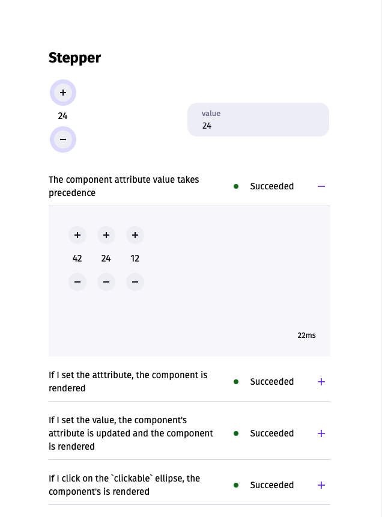

# Web Component

A thin library on Web Component that helps enforce a strict lifecycle and
develop code that is deterministic and easy to test.

This project is still in early alpha. I welcome feedback and contributions.



## Example

```js
// stepper.js
import { createComponent } from "https://raw.githubusercontent.com/i-y-land/web-component/main/library/component.js";

const observer = new MutationObserver(
  (ms) =>
    ms.forEach(({ attributeName, target }) => {
      if (attributeName === "value") {
        target.dispatchEvent(new Event("change"));
      }
    }),
);

// Predicate to decide if the component should be rendered
export const attributeChangedCallback = (_, w, v) =>
  (v !== "" && typeof Number(v) === "number") && v >= 0 && w !== v;

const connectedCallback = (element, render) => {
  element._handleAddButtonClick = render((_, { value }) => ({
    value: ++value,
  }));
  element._handleSubtractButtonClick = render((_, { value }) => ({
    value: --value,
  }));

  observer.observe(element, { attributes: true });

  element.elements.addButton.addEventListener(
    "click",
    element._handleAddButtonClick,
  );
  element.elements.subtractButton.addEventListener(
    "click",
    element._handleSubtractButtonClick,
  );
};

const disconnectedCallback = (element) => {
  element.elements.addButton.removeEventListener(
    "click",
    element._handleAddButtonClick,
  );
  element.elements.subtractButton.removeEventListener(
    "click",
    element._handleSubtractButtonClick,
  );
};

// Convenience utility to access interactive elements
const elements = {
  addButton: (e) => e.shadowRoot.querySelector("ellipse.clickable.add"),
  number: (e) => e.shadowRoot.querySelector("text.number"),
  subtractButton: (e) =>
    e.shadowRoot.querySelector("ellipse.clickable.subtract"),
};

// Enforce lifecycle through element attributes
const extend = (Component) => {
  Object.defineProperty(
    Component.prototype,
    "value",
    {
      enumerable: true,
      get() {
        return this.state.value;
      },
      set(x) {
        if (!this.hasAttribute("disabled")) {
          this.setAttribute("value", x);
        }
      },
    },
  );

  return Component;
};

// Simple deterministic render function
export const render = (e, { value }) => {
  if (!e.elements.number) return;
  e.elements.number.textContent = String(value);
};

export const Stepper = createComponent(
  "iy-stepper",
  render,
  {
    attributeChangedCallback,
    connectedCallback,
    disconnectedCallback,
    elements,
    extend,
    // Convenience utility to coerce attributes to the state
    mapAttributeToState: {
      value: Number,
    },
    // List of attributes that will trigger a render
    observedAttributes: ["value"],
    state: { value: 0 },
    // Template will be fetched, cached and attached to the component's shadow root
    templatePath: "./stepper/stepper.html",
  },
);
```

## Running the sandbox

Before running the sandbox, make sure you have [installed Deno](https://deno.land/#installation).  

```shell
$ ./run_sandbox
```

## Testing your web component

The library comes with a visual test runner for your browser.
The easiest way to get started is to use the `renderTests` function.

```js
// stepper_test.js
import { deferUntil } from ".https://raw.githubusercontent.com/i-y-land/web-component/main/library/component.js";
import { assertWhen, renderTests, test } from "https://raw.githubusercontent.com/i-y-land/web-component/main/library/test.js";
import "./stepper.js";

export const runTests = renderTests(
  test(
    "The component attribute value takes precedence",
    (root) =>
      Promise.all(
        [42, 24, 12]
          .map((v) => {
            // Create 3 components
            const e = window.document.createElement("iy-stepper");
            e.setAttribute("value", String(v));
            root.appendChild(e);

            // Wait for the component to be correctly attached and make assertions
            return assertWhen(
              () => e.isAsyncConnected,
              () =>
                e.shadowRoot.querySelector("text.number").textContent ===
                String(v),
            );
          }),
      ),
  ),
);
```

At the moment there's no CLI so you have to create a sandbox to run the tests. But it's pretty easy-peasy.

```html
<div id="stepper-test"></div>
<script type="module">
  import("./stepper/stepper_test.js")
    .then(({ runTests }) => {
      runTests(window.document.querySelector("#stepper-test"));
    }, e => console.error(e));
</script>
```

For any further help, you can:

💬 Join the I-Y community on Discord: https://discord.gg/eQfhqybmSc  
🦕 Join the Deno community: https://discord.gg/Dfez9UspqW  

💰 If you ever want to scratch that itch to sponsor this channel, you can do so  
on Github Sponsor. https://github.com/sponsors/sebastien...  
Sponsors get special perks like artwork, merch and 1-1 support.  
